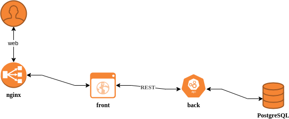
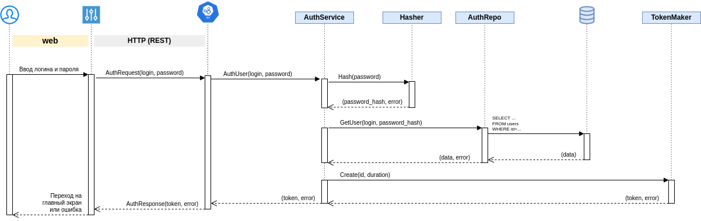
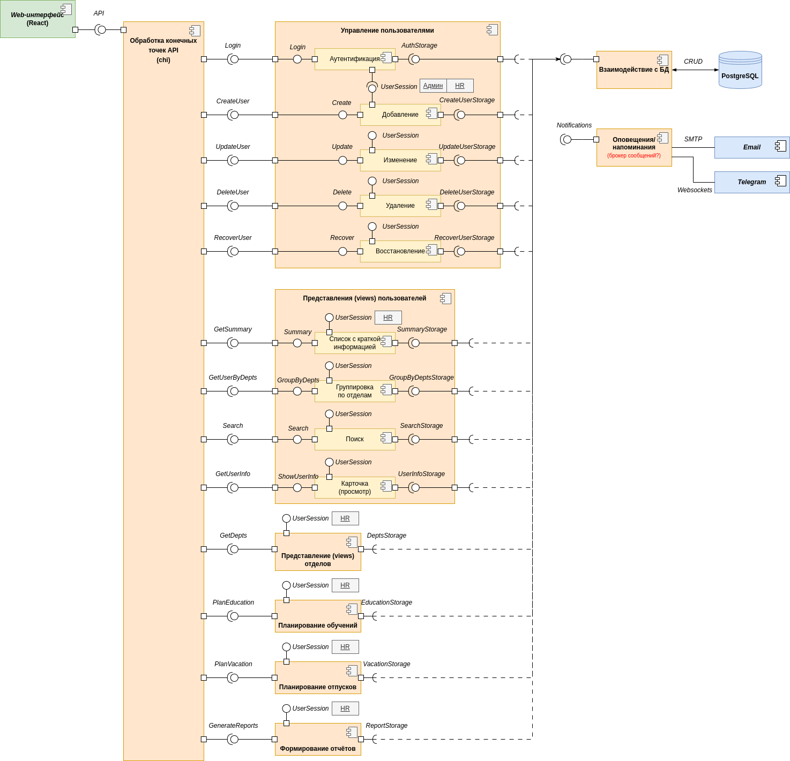
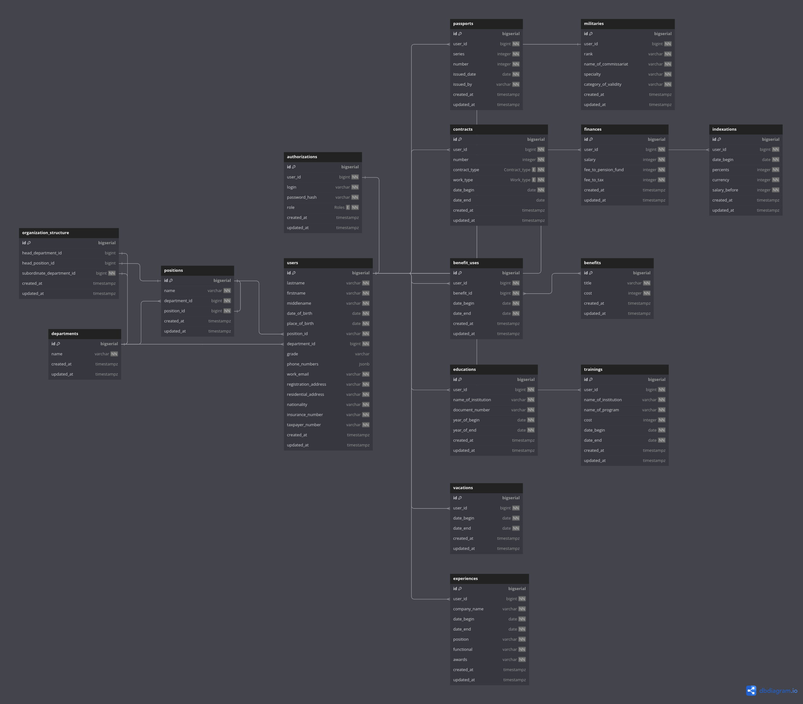

# Описание серверной части (backend) проекта "Картотека сотрудника"

- [Общая информация](#общая-информация)
- [Архитектура](#архитектура)
    - [Функциональная схема](#функциональная-схема)
    - [Диаграмма последовательности](#диаграмма-последовательности)
    - [Диаграмма компонентов](#диаграмма-компонентов)
    - [Схема базы данных](#схема-базы-данных)
- [Особенности реализации](#особенности-реализации)
    - [Сборка](#сборка)
    - [Конфигурация](#конфигурация)
    - [Стек](#стек)
    - [Используемые библиотеки](#используемые-библиотеки)
- [Дальнейшее развитие](#дальнейшее-развитие)

## Общая информация

Платформа помогает управлять персональными данными сотрудников (опыт работы, образование, хобби и др.), повысить эффективность работы HR-отдела, структурировать и оптимизировать процессы управления персоналом и сделать работу HR-отдела более эффективной и удобной.

Платформа включает в себя:

1. Централизованное хранение и управление данными сотрудников.
2. Процесс управления персональными данными.
3. Автоматизацию рутинных задач администрирования персонала.
4. Безопасность и конфиденциальность данных.

[Политика ветвления](docs/branching_policy.adoc)

[Пользовательские истории](docs/user_stories.adoc)

## Архитектура
### Функциональная схема


### Диаграмма последовательности
Представлена на примере маршрута первичной регистрации пользователя.



### Диаграмма компонентов



### Схема базы данных



## Особенности реализации
### Сборка
Для сборки приложения можно использовать команду (прописана в `Makefile`):
```make
make ...
```
Либо аналоги (выполняются из корня проекта):
```bash
GOARCH=amd64 GOOS=linux go build -o ${BINARY_NAME}-linux ./cmd/main.go
GOARCH=amd64 GOOS=windows go build -o ${BINARY_NAME}-windows ./cmd/main.go
GOARCH=amd64 GOOS=darwin go build -o ${BINARY_NAME}-darwin ./cmd/main.go
```


### Конфигурация
Приложение конфигурируется переменными окружения.

Если параметр не задан, то при запуске будет выдана ошибка и приложение завершится с кодом `1`.

| Переменная окружения    | Описание                                 |
|-------------------------|------------------------------------------|
| `PG_URL`                | Адрес подключения к базе данных          |
| `PG_POOL_MAX`           | Максимальное количество подключений к БД |
| `PG_CONN_ATTEMPTS`      | Количество попыток подключения к БД      |

### Стек
- Основной язык: Go
- Маршрутизатор/веб-фреймворк: 
- База данных: PostgreSQL
- Docker, Docker Compose

### Используемые библиотеки
- Конфигурация: 
- Работа с БД:
- Тестирование:

## Дальнейшее развитие

- [ ] 
