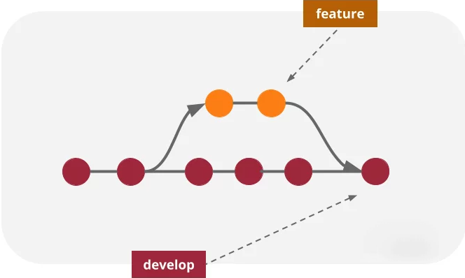

= Политика ветвления

== Основные ветки

1. *`main`* – содержится только код, готовый к релизу.
2. *`develop`* – содержатся изменения, готовые ко включению в последующий релиз.

Логика работы с ними не предполагает их удаления после выпуска очередного релиза.

Как только в ветке *develop* появляется достаточно изменений для создания нового релиза, она вливается в ветку *main* (напрямую или посредством создания специальной ветки *release-**). После чего соответствующий коммит слияния в ветке *main* помечается тегом с указанием версии релиза.

Таким образом, коммит в ветке origin/main означает выпуск нового релиза.

== Вспомогательные ветки

Для поддержки независимости разработки отдельных частей проекта, политика включает в себя несколько групп вспомогательных ветвей, срок жизни которых ограничен: после завершения выполнения определенной работы, вспомогательная ветвь вливается в одну из главных, после чего удаляется.

1. *feature branches* - ветви для разработки новых функций.
2. *release branches* - ветви релизов.
3. *hotfix branches* - ветви срочных исправлений.

=== Feature-ветки

Могут порождаться от: *develop*

Могут вливаться в: *develop*

Правило именования: любое имя, кроме *main*, *develop*, *release-*, *hotfix-*.

Используются для разработки новых функций, для которых неизвестно: будут ли они добавлены в ближайший релиз или же в какой-то более поздний. Основной смысл этой ветки в том, что живёт она ровно столько, сколько продолжается разработка функции, для которой была создана эта ветка. В это время в ветке main могут выходить релизы, не затрагивающие разрабатываемую функцию. По завершении создания функции, такая ветка либо вливается в ветку develop, либо удаляется, если эксперимент с новой функцией не удался.

Существуют в основном только в репозиториях разработчиков.

Графически взаимодействие разработчика с feature-веткой выглядит примерно так:

Создание feature-ветки:

[,shell]
----
# Переключаемся на ветвь develop
git checkout develop
# Создаём feature-ветку
git checkout -b new-feature
----

После завершения работы над функцией выполняем слияние и Push:

[,shell]
----
# Переключаемся на ветвь develop
git checkout develop
# Сливаем feature-ветку явным образом
git merge --no-ff new-feature
# Удаляем feature-ветку
git branch -d new-feature
# Выполняем пуш изменений в основной репозиторий
git push origin develop
----

Явное слияние позволяет сохранить информацию о том, что ветка *new-feature* существовала, и объединяет все её коммиты в один _merge-коммит_. Впоследствии это позволит разобраться, какие коммиты отвечают за добавление одних и тех же функций.

=== Release-ветки

Могут порождаться от: *develop*

Могут вливаться в: *develop*, *main*

Правило именования: *release-**

Необходимы для подготовки к выпуску новых релизов. Их главное назначение – внести финальные штрихи перед выпуском новой версии. В этих ветках можно вносить небольшие изменения и подготавливать файлы с метаданными о версии. Release-ветку следует создавать в тот момент, когда проект готов или почти готов к выпуску очередной версии - по крайней мере не раньше, чем вся функциональность, предназначенная к выходу в этом релизе, будет влита в ветку develop.

Создание release-ветки:

[,shell]
----
# Переключаемся на ветвь develop
git checkout develop
# Создаём release-ветку по номеру версии
git checkout -b release-4.2
----

На этой ветви запрещено вносить какие-то крупные изменения или исправлять серьёзные ошибки.

Как только все файлы проекта будут готовы к выпуску релиза, данную ветвь можно слить в основную ветку main, что и будет соответствовать выпуску релиза. После чего нужно пометить релиз соответствующим тегом, чтобы впоследствии к нему было проще обращаться. Важно не забыть слить изменения с release-ветки в ветку develop, чтобы вернуть незначительные изменения в процесс разработки следующего релиза.

[,shell]
----
# Переключаемся на ветвь main
git checkout main
# Сливаем в неё release-ветку
git merge --no-ff release-4.2
# Присвоим коммиту тег
git tag -a v4.2
# Переключаемся на ветвь develop
git checkout develop
# Сливаем в неё release-ветку, чтобы вернуть внесённые изменения в разработку
git merge --no-ff release-1.2
# Теперь можно удалить release-ветку
git branch -d release-1.2
----

=== Hotfix-ветки

Могут порождаться от: *main*

Могут вливаться в: *develop*, *main*

Правило именования: *hotfix-**

Ветки срочных исправлений нужны для внесения срочных исправлений в уже вышедший релиз. Такую ветку необходимо создать в ситуации, когда в недавно вышедшем релизе был обнаружен серьёзный баг. Предназначение этой ветки – исправить ошибку в последнем вышедшем релизе, а затем выпустить новый релиз, слив ветку hotfix в main и develop.

Смысл создания отдельной ветки в том, что работа большей части команды может продолжаться над выходом нового стабильного релиза на ветке develop, пока другая часть работает над исправлением ошибки в последнем релизе в ветке hotfix.

Чтобы создать hotfix-ветку:

[,shell]
----
# Переключаемся на ветвь main
git checkout main
# Создаём hotfix-ветку для последнего релиза
git checkout -b hotfix-4.2.1
----

Последний релиз имеет номер 4.2, поэтому релиз с исправлением бага будет иметь версию 4.2.1.

После внесения всех необходимых исправлений, нужно слить hotfix-ветку в ветку main, чтобы выпустить новый релиз, и в ветку develop, чтобы наши изменения сохранились в следующем релизе:

[,shell]
----
# Переключаемся на ветвь main
git checkout main
# Сливаем в неё hotfix-ветку
git merge --no-ff hotfix-4.2.1
# Присвоим коммиту тег
git tag -a v4.2.1
# Переключаемся на ветвь develop
git checkout develop
# Сливаем в неё hotfix-ветку, чтобы сохранить исправление бага в следующем релизе
git merge --no-ff hotfix-4.2.1
# Теперь можно удалить hotfix-ветку
git branch -d hotfix-4.2.1
----
